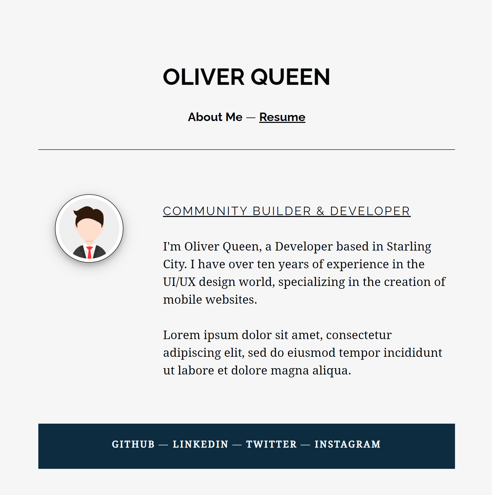

[](https://www.skillsunion.com/)
# Software Engineering Prework

Welcome to your new journey on the road towards becoming a software engineer! Before you can set out on this new adventure, let me help you prepare with the right tools and skills you will need on your journey.

We're going to use a small project to help you learn the foundational tools and skills. After all, project-driven learning is a big part of Skills Union. Think of this as a training mission in a game before the game opens up.

For this project, you're going to transform your resume into a personal website that you can show off to future employers once you finish the program. Now, that's something useful to have, wouldn't you agree?

To get a better idea of what you might be building by the end of this mission. Take a look at the personal website of Oliver Queen below for some inspiration.



To be able to build your own website based on your resume, you should follow the instructions on this page along with the recommended learning resources to get yourself ready.

All in all, it should take you no more than 2 weeks to go over all the included resources and build your first website. But if you get stuck at any point and are unable to find a solution using the included resources or Google. Then shoot us an email with all the details about your problem so we can help.

Though, before your rush out and start building your website, you should first set up your development environment on your computer and get comfortable with your tools.

## What tools do I need right now?

Professional developers usually have a lot of tools on their computers, maybe a tad too many! But you don't need most of them for now.

### Installing modern web browsers

During this course, we will be using [Google Chrome](https://www.google.com/chrome/) for our daily development and testing needs. You should go head and install it. It's also a good idea for you to install [Firefox](https://www.mozilla.org/en-US/firefox/new/), as a secondary browser for testing.

### Is it terminal?

As a developer, you're going to spend a lot of time on the terminal using the command-line interface to set up your projects, managing your code, running servers, deploying your websites, and a lot more. So it only makes sense for you to get a head start with it.

In case you are wondering “what is a command-line interface?”, I would say, it’s a developer's best friend! But, that’s just me!

We’re all used to interacting with a computer using a graphical user interface by pointing and clicking or touching stuff on a screen. The command-line interface (or CLI for short) is pretty much the same thing except, in place of a graphical interface, we type out what we want the computer to do.

**If you are using a Mac or Linux operating system,** then you already have a working command-line environment you can use.

**If you're using Windows 10,** then you're going to need to do a few things before you can get started. Watch [this video](https://www.youtube.com/watch?v=-atblwgc63E) till the 3:25 marker or read the instructions in [this article](https://docs.microsoft.com/en-us/windows/wsl/install-win10#manual-installation-steps) to set up a Linux subsystem on Windows 10 for you.

#### Practice makes perfect

Now that you have a working command-line interface, let’s get you familiar with how to use it. Though, if you don't feel safe running some of these commands on your computer, you should [follow these instructions](https://developer.mozilla.org/en-US/docs/Learn/Tools_and_testing/Understanding_client-side_tools/Command_line#terminal_%E2%80%94_considered_harmful) from the MDN article below and use [Glitch.com](https://glitch.com/) to build up your confidence.

Also on that note, whatever you do, use extreme caution when deleting files and folders using the `rm -rf` command. As you could end up accidentally deleting your whole hard drive. You’ve been warned!

If you’ve never worked with a command-line interface before. Then I recommend you [watch this video](https://www.youtube.com/watch?v=aKRYQsKR46I) to get comfortable with the terminal. And then follow the instructions from the [Command line crash course](https://developer.mozilla.org/en-US/docs/Learn/Tools_and_testing/Understanding_client-side_tools/Command_line) by MDN till the “A slightly more complex example” section. You can skip the rest.

Let’s put what you’ve learned from the resources above into practice and achieve the following tasks:

- Go to your home directory (folder)

  ```bash
  cd ~
  ```
- View files within a directory

  ```bash
  ls ~
  ```
- Create a directory in which to store a project

  ```bash
  mkdir projects
  ```
- Create a subdirectory to organize a project

  ```bash
  mkdir projects/my-resume
  ```
- Create files to contain project information

  ```bash
  cd projects/my-resume

  touch index.html
  ```
- Edit and delete files

  ```bash
  echo "Hello World" >> index.html

  cat index.html

  rm index.html
  ```
- Navigate within a project and your computer

  ```bash
  cd ..

  pwd
  ```
- Learn about different commands and how to use them

  ```bash
  man clear
  ```
  _Use arrow-keys to navigate and press `q` to quit_

<div align="center">
  

  _Look at that, you can now control the Matrix! Sweet!_
</div>


The resources above should help you get comfortable with some of the basic commands. But if you want to learn more about them, then try using [tldr.ostera.io](https://tldr.ostera.io/) or the `man` command itself.

#### Side Quest (Optional)

If you are curious about all the different files and folders on your computer that you can now see through the command-line, watch the [Linux Directories Explained in 100 Seconds](https://www.youtube.com/watch?v=42iQKuQodW4) video to help you answer that question.

### Installing a text editor

During this course, we're going to be using Visual Studio Code. It's a free and extensible code-editor that will serve you well for a long time.

Make sure to [install Visual Studio Code](https://code.visualstudio.com/) on your computer as it supports all the major operating systems. I recommend you read [this article on codecademy](https://www.codecademy.com/articles/visual-studio-code) to get started.

### Managing your code

As difficult as it can be to track all the changes you've made in your code, it is even more so when working in a team. That's why developers use Git and GitHub to manage code changes. Our code is our livelihood so it's important that we safely and frequently store our work. This allows us to go back to a point when our app was last working if we make a feature that ends up breaking our app.

You don't need to master Git right away. For now, just being able to create a repository, committing your changes, and pushing them to GitHub to share with others is enough.

#### Setting up Git

1. [Download and install the latest version of Git](https://git-scm.com/downloads)
1. [Set your username in Git](https://docs.github.com/en/github/using-git/setting-your-username-in-git)
1. [Set your commit email address in Git](https://docs.github.com/en/github/setting-up-and-managing-your-github-user-account/setting-your-commit-email-address#setting-your-commit-email-address-in-git)
1. Create an [account on GitHub](http://github.com/) using the same email address

It takes time to get used to working with Git and GitHub. For a better understanding about Git, give [this video a watch](https://www.youtube.com/watch?v=HVsySz-h9r4) and read through the [Git Handbook](https://guides.github.com/introduction/git-handbook/) for some practice.

## Introducing HTML & CSS

**The best of friends!**

Now that you have set up a development environment and a working knowledge of how it all works. It’s time for you to jump into learning HTML and CSS.

To help you do that, go through the [Intro to HTML](https://codigo.thinkific.com/courses/intro-to-html) and [Styling with CSS](https://codigo.thinkific.com/courses/styling-with-css) short courses on the Codigo website. You can sign into these two courses for free - the first course is free and you only have to enter the coupon code to get access to Styling with CSS for free. You should have received the coupon code in the email you received introducing this prework. These 2 short courses include videos on each topic along with practice sessions to help you learn HTML & CSS.

#### Bonus Level (Optional)

If you are still looking for some more practice, then check-out [CSS Diner](https://flukeout.github.io/), a fun little game that'll have you eating up CSS.
#### Side Quest (Optional)

Check out the [Introduction to HTML](https://developer.mozilla.org/en-US/docs/Learn/HTML/Introduction_to_HTML) and [CSS first steps](https://developer.mozilla.org/en-US/docs/Learn/CSS/First_steps) resources from Mozilla Developer Network as a reference if you want to look something up.

Remember, you don't have to learn about most of the topics mentioned so far in detail just yet. The basics will do for now. But, if you want to learn more, then feel free to do so.

## The Project

Do you remember the personal website of Oliver Queen from before? If you want your website to be anything like it. You're going to need to create two pages that link to each other. The first page will be about you, and the second page will include your resume details.

If you're asking yourself, “how am I even going to build this?” Then worry not, everything you have learned so far has prepared you for this. Continue following this guide, and it will take you to the end goal.

Let's start by figuring out what information you want to include on your website. The following items are required and you should include them across the two pages:

- Job Title
- Experience
- Education & Certifications
- Bio
- Personal Interests
- Contact Information
- Social Media Links

Though, feel free to include anything else you might like.

Now that you have an idea of what will go into your website, we can talk about some technical requirements you'll need to meet while building your website.

- Link both pages together using the `a` tag
- Use a unique `title` and a single unique `h1` tag
- Show images using `img` tags including unique `alt` attributes
- Use an external CSS stylesheet to style your pages
- Select at least 5 elements on the page and apply at least 5 different CSS properties (`font-size`, `color`, `font-family`, `background`, `text-decoration`) to these elements
- Use at least 6 different HTML tags (`h1`, `h2`, `h3`, `h4`, `h5`, `h6`, `p`, `ul`, `ol`, `a`, `img`) on your pages
- Follow naming conventions and maintain consistency across your `.html` and `.css` files
- Indent nested elements to increase your code's readability
- **Optional:** Experiment by adding additional HTML tags and CSS properties not mentioned in the requirements
- Use a Git repository to contain frequent commits for your project dating back to when you started the project.
- Make sure you connect your projects Git repository with the corresponding repository on GitHub and keep them synced.
- Use meaningful commit messages to describe the changes you’re committing.
- The GitHub repository should include a [README](https://docs.github.com/en/github/creating-cloning-and-archiving-repositories/about-readmes) file written using [Markdown](https://guides.github.com/features/mastering-markdown/). It should include an explanation of all the technologies used, the approach you took, any documentation for the project, and any other relevant information, including unsolved problems or issues.
- **Optional:**  It would be pretty cool if you can upload your website to the internet. It will make it easy for you to share the end-product with others to show off. You can use [this guide](https://docs.github.com/en/github/working-with-github-pages/creating-a-github-pages-site) to help you upload your website to GitHub Pages.

## Almost there!

Once you’ve completed the project, make sure you push all your changes from the local Git repository to your project's public GitHub repository. And share the link for this GitHub repository at least 4 days before the start date of your cohort by emailing us.

You should now be ready to start your new journey. But if you happen to need any help, then don't be shy and ping us.

Good luck!
